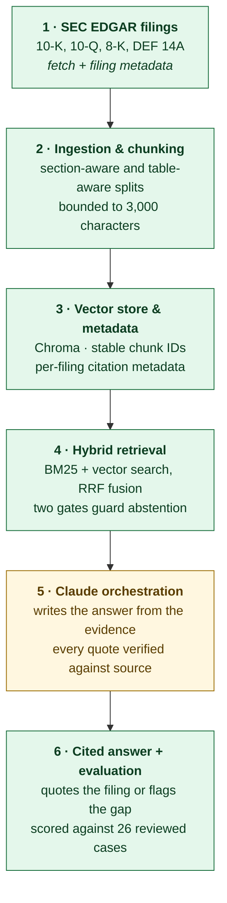

# SEC Simplifier — Build Progress

Status as of **2026-09-06**. All six roadmap weeks are built, and the app has
since been opened up from one hard-coded ticker to any US company searched on
demand. It answers natural-language questions from a chosen company's EDGAR
filings, shows the supporting excerpt and source link, and says *"I don't see
this disclosed"* when the filings don't support an answer.

**Two things are measured and worth knowing before reading further:**

- Across three companies, recall is **100%** and every failure is a question that
  should have been *declined*. Specificity ranges 25–62% depending on the
  company — the retrieval thresholds do not generalize, and no distance floor
  separates the two classes on two of the three. See
  [the generalization finding](#what-a-second-company-revealed-the-thresholds-do-not-generalize-).
- The Claude generation step — the only component that reads evidence rather
  than scoring vocabulary, and so the only remaining mechanism that could fix
  abstention — **has still never run.** There is no API key on this machine.

- Detailed setup and run instructions: [README.md](README.md)
- Active code lives in this folder (`sec-simplifier/`). `../edgar_copilot/` is a
  stale earlier copy and is not maintained.

---

## The pipeline



**Legend** — 🟢 done · 🟡 partial (baseline in place, work remaining) · 🔵 planned

| Stage | State | Where |
| --- | --- | --- |
| 1 · SEC EDGAR filings | 🟢 done | [src/sec_client.py](src/sec_client.py), [src/ingest_filings.py](src/ingest_filings.py) |
| 2 · Ingestion & chunking | 🟢 done — incl. proxy statements | [src/grounded_qa.py](src/grounded_qa.py), [src/tables.py](src/tables.py), [src/corpus.py](src/corpus.py) |
| 3 · Vector store & metadata | 🟢 done | [src/vector_store.py](src/vector_store.py), [src/build_index.py](src/build_index.py) |
| 4 · Hybrid retrieval | 🟢 done | [src/grounded_qa.py](src/grounded_qa.py), [app.py](app.py) |
| 5 · Grounded generation (Claude) | 🟡 built and unit-tested; **live path unrun — needs an API key** | [src/generate.py](src/generate.py) |
| 6 · Cited answers & evaluation | 🟢 scored 19/26 in extractive mode, with a tracked baseline | [evaluate.py](evaluate.py), [tests/golden_set.json](tests/golden_set.json) |

---

## Week 1 — SEC EDGAR filings 🟢

**Goal:** download a defined company scope with source URLs and filing metadata.

Done:

- [src/sec_client.py](src/sec_client.py): ticker → CIK lookup via
  `company_tickers.json`, recent-filings lookup via the `submissions` API, and
  primary-document download. Polite `User-Agent` enforcement and request delay to
  stay within SEC rate guidance.
- [src/ingest_filings.py](src/ingest_filings.py): CLI that pulls the *N* most
  recent 10-K, 10-Q, 8-K, and DEF 14A filings for a ticker.
- Raw HTML saved under `data/raw/`; a metadata record per filing (ticker, CIK,
  form, filing date, period of report, accession number, primary document,
  source URL) saved to `data/metadata/<TICKER>_filings.json`.
- Current corpus: **8 NVCT filings** (2× each form) → **120 chunks**.

---

## Week 2 — Ingestion, chunking, and the grounding baseline 🟡

**Goal:** parse filing HTML into section-aware chunks and answer questions only
from that text, with citations and honest abstention.

Done:

- **Section-aware chunking** ([`build_chunks_from_html`](src/grounded_qa.py)):
  splits filing HTML on `Item N.` headings, keeping ticker, form, filing date,
  section heading, document name, and SEC source URL on every chunk. Falls back
  to a cleaned full-text chunk when a filing has no recognizable item headings.
- **Transparent lexical retrieval**
  ([`retrieve_supporting_chunks`](src/grounded_qa.py)): scores chunks by
  meaningful query-term overlap (plural-normalized, stop-worded, ticker-symbol
  excluded so a company-wide term can't inflate a match). Returns nothing when
  the best score is below a threshold — it never falls back to unrelated text.
- **Grounded answer contract** ([`answer_question`](src/grounded_qa.py)):
  returns an answer plus citations, an evidence list (section, form, date,
  excerpt, source URL), and a plain-English *"why it matters"* note — or the
  explicit *"I don't see this disclosed in the filings available for this
  company."* response with no citations.
- **Local browser UI** ([app.py](app.py)): runs entirely on `127.0.0.1:8000`,
  auto-detects downloaded EDGAR filings (demo corpus fallback), starter
  questions, evidence cards with source links, supported/unsupported badge.
- **Contract tests** ([tests/test_grounded_qa.py](tests/test_grounded_qa.py)):
  supported vs. unsupported answers, retrieval relevance, abstention.

Not yet done (carried forward):

- The *"answer"* string is currently a truncated slice of the top chunk with a
  template prefix — real synthesis is Week 5.

Two defects in this chunker were found and fixed in Week 4 (see below): text was
being counted once per nesting level, and the table of contents was being read as
real section headings.

---

## Week 3 — Vector store and metadata 🟢

**Goal:** persist chunks and metadata in Chroma with a stable chunk ID, filing
accession number, section, period, and source URL.

Done:

- **Stable chunk IDs** ([`make_chunk_id`](src/grounded_qa.py)):
  `accession:section-slug:position`. Re-running ingestion upserts the same rows
  instead of creating duplicates.
- **Fuller citation metadata on every chunk:** added `accession_number` and
  `period_of_report` (from EDGAR's `reportDate`, falling back to the filing date
  when EDGAR leaves it blank, e.g. some 8-Ks) — not just the filing date. This is
  what year-over-year comparison will key on.
- **Persistent Chroma collection** ([src/vector_store.py](src/vector_store.py)):
  `data/chroma/`, cosine similarity, Chroma's default on-device embedding model
  (`all-MiniLM-L6-v2`, cached to `~/.cache/chroma` on first use). No filing text
  or query leaves the machine. `build_vector_store()` upserts by chunk ID;
  `query_vector_store()` returns metadata + text + distance; `store_stats()`
  summarizes what's persisted.
- **Index builder CLI** ([src/build_index.py](src/build_index.py)):
  `python -m src.build_index`, with `--probe "question"` to see how similarity
  search ranks a query against the persisted chunks.
- **Tests:** stable-ID determinism, position-awareness, vector-store round-trip
  (metadata preserved, re-index does not duplicate), empty-store behavior.
  `chromadb` tests `importorskip` so the lexical baseline still tests clean
  without the dependency.

Deliberately **not** wired into the live answer path yet: the app still answers
through the Week 2 lexical scorer. Chroma is persistence only until Week 4.

---

## Week 4 — Hybrid retrieval 🟢

**Goal:** combine lexical and vector search, rerank, and keep the abstention
contract intact.

### Table-aware chunking ([src/tables.py](src/tables.py))

A filing uses `<table>` for two unrelated jobs: real financial data and page
layout. The 10-Q has 207 tables, of which **17 carry data**. Layout tables are
left alone; data tables are lifted out, captioned, and indexed separately.

- **Detection** — at least 3 rows, at least 3 numeric cells, at least 2 columns.
  The table of contents passes that bar (page numbers are numeric), so it is
  excluded explicitly.
- **Captions** — filings rarely mark one up, so the title is the nearest
  preceding prose, skipping text that belongs to another data table.
- **Rendering** — one row per line, cells pipe-separated, so a figure keeps the
  label that explains it:

  ```
  CONDENSED BALANCE SHEETS (USD in thousands) (unaudited)
  June 30, | December 31,
  2026 | 2025
  Cash and cash equivalents | 22,160 | 31,634
  TOTAL ASSETS | 22,376 | 31,709
  ```

  Before this, that content was indexed as an unlabeled run of digits.

### Two chunker defects found while validating

Neither was visible until retrieval started returning junk sections:

- **Text was counted once per nesting level.** The walker visited every
  `div`/`p`/`td`, so a paragraph inside three nested divs was copied three times.
  `Item 1C. Cybersecurity` held 50,217 characters across two near-identical
  chunks; the largest chunk in the corpus was **466,558 characters** — most of
  the document, repeated. Fixed by reading only *leaf* block elements.
- **The table of contents was creating sections.** Its cells read as `Item N.`
  headings, so the chunker opened a section at the TOC entry and filed the front
  matter under it — `Item 6. [Reserved]` ended up holding 4,967 characters of
  Item 7's MD&A. Fixed by dropping TOC tables before the walk.

Chunks are now split on sentence boundaries at 3,000 characters. Effect on the
corpus:

| | before Week 4 | after |
| --- | --- | --- |
| chunks | 120 | 529 (75 tables, 454 prose) |
| largest chunk | 466,558 chars | 3,194 chars |
| `Item 6. [Reserved]` | 4,967 chars of MD&A | 27 chars |
| `Item 1C. Cybersecurity` | 50,217 chars (duplicated) | 15,264 chars |

### The retriever ([src/grounded_qa.py](src/grounded_qa.py))

`retrieve_hybrid()` runs both retrievers, gates each independently, then fuses
the survivors with **reciprocal rank fusion** (`Σ 1/(60 + rank)`), which needs
only rank order — so an integer overlap count never has to be compared against a
cosine distance. Results are de-duplicated by `chunk_id`.

**Ranking is BM25**, not raw overlap count. Raw counts favour long chunks: with
whole-`Item` chunks, almost any question clears the bar by chance, which is how
`Item 4. Controls and Procedures` came back as the best evidence about cash.
BM25 weights rare terms above common ones and normalizes for length. The corpus
index is memoized against a corpus fingerprint, since tokenizing 529 chunks per
question dominated the cost.

**Abstention uses two gates, and a chunk must clear at least one:**

| Gate | Rule |
| --- | --- |
| Lexical | ≥ 2 matching terms (section headings count double) **and** ≥ 60% of the question's meaningful terms covered |
| Vector | cosine distance ≤ 0.60 |

The coverage half of the lexical gate was added after measurement: a bare
two-term bar is trivially cleared, because a long filing contains *some* chunk
mentioning "patents" or "address".

### What the gates actually measure

Against the 13 golden-set cases, neither signal separates on its own:

| | should answer | should abstain |
| --- | --- | --- |
| vector distance | 0.447 – **0.599** | **0.553** – 0.779 |
| lexical gate (count only) | 1, 1, 2, 2, 8 | 1, 1, 1, 2, 3 |

The lexical count is useless as a discriminator — the ranges are identical.
Vector distance nearly separates cleanly, which is why the floor sits at 0.60,
just above the highest on-topic question.

**Current score: 11/13.** Both misses are the same shape and are recorded as
known gaps rather than tuned away:

- *"How many patents does Apple hold?"* — the filings do discuss patents, so
  retrieval finds real, on-topic-looking evidence.
- *"What is the CEO home address?"* — an address is present, just a corporate one.

No retrieval threshold can fix these: the evidence genuinely matches the words.
Distinguishing "Apple's patents" from "our patents" requires **reading** the
retrieved text, which is Week 5. Tuning thresholds until these two passed would
have overfit to thirteen hand-written questions and cost real recall.

### Wired into the app

[app.py](app.py) now answers from the vector store instead of re-parsing filing
HTML on every request, and caches the corpus for the life of the process.
Request latency went from ~2.5 s to **0.15 s**. The status line reports which
mode is live (`Hybrid search over NVCT (529 indexed chunks)`), and the app falls
back to lexical-only when `chromadb` is absent or the index has not been built.

### Evaluation scaffold

[tests/golden_set.json](tests/golden_set.json) holds 13 reviewed cases — the
question, whether the filings should support an answer, the expected section
where unambiguous, and *why*. Several record what the lexical baseline alone
does, which is what makes the hybrid win legible.
[tests/test_golden_set.py](tests/test_golden_set.py) asserts the
supported/abstain contract on non-gap cases, and fails if a known gap starts
passing so the file cannot drift out of date. Scoring is Week 6.

**Tests: 34 passing** (19 unit + 15 golden set). The golden-set module skips
cleanly when the index has not been built.

[run_demo.py](run_demo.py) answers every golden-set case both ways and prints the
verdicts side by side, which is the shortest way to see what Week 4 bought:

```
  keyword only : 9/13 correct
  hybrid       : 11/13 correct
```

---

## Week 5 — Grounded generation with Claude 🟡

**Goal:** a model reads the retrieved evidence and writes the answer, or declines.

> **Status: built and unit-tested, but the live API path has never run.** There is
> no `ANTHROPIC_API_KEY` on this machine, so every test below uses an injected
> fake or a stub client. The request shape, the verification logic, and the
> fallback behaviour are all covered; whether Claude's *judgement* actually
> closes the two known gaps is untested. See "How to verify" below.

### The design ([src/generate.py](src/generate.py))

Retrieval narrows the filing to a few candidate chunks. It matches words, not
meaning — which is exactly why Week 4 ended with two unfixable gaps. This stage
adjudicates.

- **Structured output.** `client.messages.parse()` with a Pydantic
  `GroundedAnswer` model (`supported`, `answer`, `citations`,
  `reason_if_unsupported`). A boolean field is a more reliable abstention signal
  than parsing prose for a refusal phrase.
- **The model never handles citation metadata.** It returns only an evidence
  block id and a quote. Section, form, dates, and source URL are looked up
  locally from the id, so a citation cannot be wrong about where it came from.
- **Every quote is verified before display.** `verify_citations()` checks the
  quote appears verbatim in the chunk it names, normalizing only cosmetic
  differences (curly quotes, dashes, whitespace, case). A citation that fails is
  dropped; **an answer left with no verified citation is downgraded to an
  abstention.** A model that invents a quote cannot get it past this.
- **The generator can only narrow.** It is called *after* retrieval and only
  sees chunks retrieval already approved, so it can reject evidence but never
  introduce any. Questions retrieval rejected never reach it.
- **Failure is contained.** An API error, timeout, or safety refusal falls back
  to the Week 4 extractive answer rather than erroring — degraded, but still
  cited.

Model is `claude-opus-5` with adaptive thinking, overridable with
`SEC_SIMPLIFIER_MODEL`. `anthropic` is an optional dependency like `chromadb`;
without it, or without credentials, the app runs exactly as it did in Week 4 and
the status line says so.

### Removed: the hard-coded keyword guard

`answer_question` special-cased the words "lawsuit", "settlement", and "exact",
abstaining unless the evidence contained one of five other keywords. It was a
placeholder for judgement the model should make. Deleting it did not break the
abstention test that motivated it — the Week 4 lexical gate already handles that
case on its own.

### What is actually tested

53 tests pass, none of which call the API:

- **Quote verification** — fabricated quotes rejected; a real quote attributed to
  the wrong chunk rejected; unknown chunk ids rejected; cosmetic differences
  (case, whitespace, typographic quotes and dashes) tolerated.
- **The downgrade** — a confident answer whose every quote fails verification
  comes back unsupported with an empty answer.
- **Request shape**, against a stub client — model, `output_format`, adaptive
  thinking, and evidence ids present in the prompt.
- **Refusal handling** — `stop_reason: "refusal"` becomes an abstention.
- **Contract wiring** — a generated answer replaces the extractive one and cites
  verified quotes; a generator that abstains produces the standard
  not-disclosed response; a generator that raises falls back; the generator is
  never consulted when retrieval found nothing.

### How to verify the part that is untested

Cheapest first — one question, one API call, every stage shown:

```powershell
$env:ANTHROPIC_API_KEY = "sk-ant-..."
& "C:\Users\yceri\AppData\Local\Programs\Python\Python310\python.exe" .\ask.py "How much cash does the company have on hand?"
```

[ask.py](ask.py) prints what retrieval selected, the answer, the quotes that
passed verification, any that were rejected, and the token cost. Then the full
suite:

```powershell
& "C:\Users\yceri\AppData\Local\Programs\Python\Python310\python.exe" -m pytest -q
```

The golden-set tests pick the generator up automatically. The signal to watch is
`test_known_gaps_are_still_recorded_as_gaps` — it **fails** when a known gap
starts passing, and its message says to clear the flag. If Week 5 worked, that
test failing is the evidence.

Expect real cost: 13 golden-set cases × ~2-4K input tokens each on Opus 5.

---

## Week 6 — Evaluation 🟢

**Goal:** turn the golden set from a pass/fail contract into measured metrics,
and see what the measurement says.

### The harness ([evaluate.py](evaluate.py))

```powershell
& "C:\Users\yceri\AppData\Local\Programs\Python\Python310\python.exe" .\evaluate.py
```

Three metric groups, because they fail independently:

- **Answer rate** — split into *answered when it should* and *declined when it
  should*. A single accuracy number hides the asymmetry, and the asymmetry is
  the whole story here.
- **Citations** — does an answer cite anything, and does it cite the section a
  reviewer said it should?
- **Grounding** — how many quotes were rejected as not present in the evidence.
  Only meaningful in generation mode; extractive answers quote the chunk
  directly.

`--save-baseline` records a run to [tests/eval_baseline.json](tests/eval_baseline.json);
every later run prints the delta, so a change that helps one metric and quietly
costs another is visible.

### Current score

```
ANSWER RATE
  answered when it should     13/13     100%
  declined when it should      6/13      46%
  overall                     19/26      73%

CITATIONS
  answers that cite anything  20/20     100%
  cited the expected section   4/5       80%
```

**Recall is perfect and specificity is 46%.** The system answers everything it
should and declines less than half of what it should. Every one of the seven
failures is a question that should have been declined — there are no cases where
it wrongly refused.

### The golden set, 13 → 26 cases

Grown to cover the 10-Q and DEF 14A deliberately, and to include *hard
negatives* — questions where retrieval finds genuinely on-topic text that does
not contain the fact. Failures are classified:

| Class | Meaning | Cases |
| --- | --- | --- |
| `subject_mismatch` | Evidence about a different company, person, or kind of thing | 2 |
| `fact_not_stated` | Evidence on-topic, but the specific figure/date/event is absent | 5 |

The starkest is *"What is the weather forecast for New Jersey?"* — answered,
because the company is headquartered in New Jersey and the state name appears
throughout. That a question this obviously unanswerable still gets through is the
clearest single argument for a reading step.

Adding these deliberately **lowered** the score from the Week 4 headline. That is
the point: the earlier number was flattered by an easy set.

### What evaluation found: 98% of both proxy statements was being discarded

Building the DEF 14A cases surfaced a silent data-loss bug. `build_chunks_from_html`
recognized only `Item N.` headings — and a proxy statement contains **none**. Both
DEF 14A filings fell through to the whole-document fallback, which truncated at
2,000 characters:

| | before | after |
| --- | --- | --- |
| DEF 14A chunks | 2 | 110 |
| DEF 14A text indexed | ~4 KB of ~212 KB (2%) | all of it |
| corpus total | 529 | 637 |

Fixed by falling back to the proxy's ALL-CAPS headings (`EXECUTIVE COMPENSATION`,
`REPORT OF THE AUDIT COMMITTEE`) when no Item heading is found, and by windowing
the last-resort fallback instead of truncating it. The rule is a *fallback*, so it
cannot fragment a 10-K on an all-caps table caption — 10-K and 10-Q chunk counts
are unchanged to the chunk.

This matters beyond tidiness: executive compensation, director biographies,
auditor fees and related-party transactions live in the proxy. Before this, the
system could not see any of them.

### A regression the harness caught immediately

Adding 110 proxy chunks broke a case that previously passed: *"What stock
exchange is the company listed on?"* stopped citing `Item 5. Market for
Registrant`. Diagnosis:

- The correct chunk holds the literal sentence and still passes both gates.
- It lands at **lexical rank 7** and **vector rank 13** (distance 0.593), fusing
  to **rank 4** — one slot below the cut.
- Beneficial-ownership sections in the 10-K and proxy share the words "stock"
  and "listed" and outrank it.

Three fixes were swept against the whole set before concluding: the BM25
length-normalization constant across `0.0–1.0`, the vector candidate pool across
`5–80`, and per-section diversity. **None changed any metric.** So it is recorded
as a `section_known_gap` with the diagnosis, not tuned around — the same
discipline as Week 4. The answer is still correct and cited; only the section is
wrong.

### Also in Week 6

- **Evidence diversity** — at most two chunks from any one section, so one
  mislabelled heading cannot own every evidence slot. Honestly: this changed no
  measured metric on this set. It is kept because three passages from one
  section make one point, which the current metrics do not capture.
- **Prompt caching** — the system prompt is identical on every request and
  renders before the evidence, so it carries a cache breakpoint (~700 tokens,
  above Opus 5's 512-token minimum). `cache_read_tokens` is reported back;
  zero across repeated questions means it is not caching.
- **UI** — evidence cards now label each passage *Verified quote* or *Filing
  excerpt*, so a reader can tell which guarantee they have.

**Tests: 77 passing** (up from 53), including the harness's own arithmetic — the
project's claims about itself rest on that code, so it is tested rather than
trusted.

### Still unrun

Everything above is measured in **extractive mode**. The generation path still
has no API key behind it, so the seven open gaps have never been shown to Claude.
All seven are exactly the shape Week 5 was built for.

---

## Future work

### Week 6 remainder — needs an API key 🔵

The scoring, the grown set, caching and the UI are done. What remains needs
credentials:

- **Record a generation-mode baseline.** `evaluate.py --save-baseline` with a key
  set, alongside the extractive one, to measure what the model is worth. The
  headline number to watch is *declined when it should*, currently 6/13.
- **Close or re-classify the seven open gaps.** If Claude closes them, clear the
  `known_gap` flags. If it does not, the classification tells us which kind it
  struggles with — `subject_mismatch` and `fact_not_stated` may not be equally
  hard.
- **A support metric.** Quote verification proves a quote is genuine, not that it
  licenses the claim built on it. Measuring that needs either human review or an
  LLM judge scoring answer-against-evidence — the harness already returns
  everything such a judge would need.
- **Confirm caching works.** `cache_read_tokens` should be non-zero from the
  second question onward; if it is zero, the prefix is below the model's
  minimum.

---

## After the roadmap: any company, on demand 🟢

The MVP was scoped to one hard-coded ticker. It now takes any US company with a
ticker in EDGAR's mapping, ingested on demand from the UI.

Most of the foundation was already company-agnostic — `get_cik_for_ticker` takes
any symbol, every chunk already carried a `ticker`, and chunk IDs are keyed on
globally-unique accession numbers, so one Chroma collection holds every company
without collisions. What actually had to change:

- **Scoped reads.** `load_all_chunks(ticker=...)` and
  `query_vector_store(..., ticker=...)` filter by company. Without this, two
  companies in one store would answer each other's questions — and BM25 would
  judge term rarity across all of them rather than within one filer's filings.
- **Two caches that would have broken.** `_lexical_index` cleared itself on every
  miss ("single-corpus process"), which would have re-tokenized on every company
  switch; it is now an LRU of 8. `app.active_corpus` was `lru_cache(maxsize=1)`
  over *everything*; it is now `company_corpus(ticker)`.
- **On-demand ingestion** ([src/company.py](src/company.py)) — resolve the ticker,
  download 8 filings, chunk, embed, index, reporting progress through a callback
  rather than printing. A filing that fails to download is skipped rather than
  losing the company.
- **A background job in the app.** Ingestion takes 30–90 seconds, too long for
  one request, so it runs on a thread and the page polls `/api/company/status`.
  One load at a time, since two would write the same collection.
- **UI** — a company dropdown, a ticker box, and a progress bar.

`SEC_USER_AGENT` is now required to fetch anything; without it the app runs
read-only over what is already indexed and says why.

**Tests: 98** (up from 77). The ingestion flow is covered against a stubbed SEC
client — including the partial-download path — so none of it needs the network.

### The live path works

Three companies are now indexed from EDGAR through the app: NVCT (637 chunks),
AAPL (753 chunks, 221 tables) and QURE (1,310 chunks). Apple's filings are far
more table-heavy than NVCT's and the chunker handled them without changes.

---

## What a second company revealed: the thresholds do not generalize 🔴

This is the most important measurement in the project, and it is a negative
result.

Nineteen of the 26 golden-set cases are marked `portable` — their expectation
holds for any US filer, so they can be scored against any company with
`python evaluate.py --ticker AAPL`. Run against all three, on the same 19
questions:

| Company | recall | specificity | overall |
| --- | --- | --- | --- |
| NVCT | 11/11 · **100%** | 5/8 · **62%** | 16/19 · 84% |
| AAPL | 11/11 · **100%** | 2/8 · **25%** | 13/19 · 68% |
| QURE | 11/11 · **100%** | 3/8 · **38%** | 14/19 · 74% |

**Recall is perfect on every company. Specificity spans a 2.5× range on
identical questions.** Everything the pipeline gets wrong, on every company, is
a question it should have declined.

### Why: there is no threshold that works

Taking the best vector distance for each question:

| | should-answer (max) | should-abstain (min) | separable? |
| --- | --- | --- | --- |
| NVCT | 0.583 | 0.620 | yes — a clean gap |
| AAPL | 0.579 | **0.530** | **no — the ranges overlap** |
| QURE | 0.593 | **0.537** | **no — the ranges overlap** |

The should-*answer* range is stable across companies (~0.59 at the top). The
should-*abstain* range is not: it collapses toward the answer range on larger,
broader corpora. On NVCT the 0.60 floor sat neatly in a gap. On Apple there is
no gap — an off-topic question like "what is the company's carbon emissions
target?" lands at 0.530, closer than several questions that genuinely should be
answered.

The cause is corpus breadth, not corpus size alone. Apple's filings really do
discuss environmental commitments, analyst expectations, and named executives at
length, so a semantically near neighbour exists for almost anything. NVCT is a
small clinical-stage pharma and simply has less surface area to match against.

**The 0.60 floor was fit to NVCT.** Week 4 swept it against 26 NVCT questions and
found it stable; that stability was a property of one company, not of the method.

### What this means

Retrieval thresholding cannot deliver abstention. Not "does not yet" — *cannot*,
because on two of three companies the two classes are not linearly separable by
distance at all. Lowering the floor to catch Apple's 0.530 abstains would throw
away Apple's 0.579 legitimate answers.

This is the strongest evidence in the project for why the Week 5 generation step
exists. It stops being an enhancement and becomes the only remaining mechanism
that could work, since it is the only component that reads the retrieved text
rather than scoring its vocabulary. It is also still unrun.

The three failures common to all companies — home address, earnings call,
weather forecast — are the same `subject_mismatch` and `fact_not_stated` classes
recorded in Week 6, now confirmed to be company-independent rather than quirks
of one filer.

---

## Known weaknesses / open risks

- **Week 5's live path has never run.** No API key on this machine. The wiring,
  verification, and fallback are unit-tested against fakes; Claude's actual
  judgement on these filings is unverified. This is the largest open risk in the
  project, and every measurement below is therefore extractive-mode only.
- **Specificity is 46%.** Seven of 26 golden-set questions are answered when they
  should be declined. Every failure is of this kind — the system has never
  wrongly refused. Retrieval cannot fix these; all seven are recorded with a
  diagnosis and a class.
- **Verification proves a quote is real, not that it supports the claim.** A
  model could quote accurately and still draw a conclusion the quote does not
  license. Measuring that needs a judge, and is not built.
- **Cost per question is real.** Every answered question is an Opus 5 call with
  several thousand tokens of evidence. The system prompt is cached; the evidence
  is not, and cannot be, since it differs per question. No per-session budget.
- **Thresholds are validated on 26 cases, one company.** The 0.60 distance floor
  and 60% coverage bar were swept against this set and are stable across it, but
  26 questions on one filer is a small basis.
- **Section labels can be wrong in proxy statements.** The ALL-CAPS heading rule
  cannot tell a section heading from a table row label rendered as a `<div>`.
  Ten ownership-footnote chunks currently carry the label `ALL CURRENT DIRECTORS
  AND NEOS AS A GROUP`. The content is fine; the label is not, and section
  matches carry double weight in the lexical gate.
- **Page furniture leaks into chunks.** Running headers and page numbers
  ("`None. 55 Table of Contents`") still ride along in short chunks. Harmless for
  retrieval, ugly as a citation shown to a user.
- **Split cells could drop a minus sign.** Negative figures are rendered as
  `( 13,070 )` in this filer's HTML and survive intact, but a filer that splits
  `(`, `13,070`, `)` into three cells would lose the parentheses, and with them
  the sign. Not yet defended against.
- **`period_of_report` backfill** — the existing `data/metadata` JSON predates the
  `reportDate` capture, so some filings fall back to the filing date until
  re-ingestion.
- **Abstention is the whole remaining problem.** Across three companies and 19
  shared questions, recall is 100% and every single failure is a question that
  should have been declined. Nothing is wrongly refused; plenty is wrongly
  answered.
- **Retrieval thresholds do not generalize - measured, not suspected.** The 0.60
  distance floor was fit to NVCT. On AAPL and QURE the should-answer and
  should-abstain distance ranges overlap, so no floor separates them. Specificity
  falls from 62% to 25% on the same questions.
- **No cross-company comparison.** Each answer is scoped to one company by
  design. Comparing two in a single answer needs period alignment and line-item
  reconciliation, which is its own project.
- **Disk grows per company** — roughly 640 chunks and a few MB of raw HTML each.
  Nothing evicts old companies.
