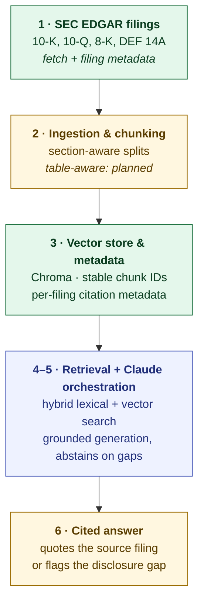

# SEC Simplifier — Build Progress

Status of the six-week build as of **2026-09-03**. The project is a single-company
(ticker **NVCT**) grounded-Q&A MVP over EDGAR filings: it answers natural-language
questions using filing text, shows the supporting excerpt and source link, and
says *"I don't see this disclosed"* when the filings don't support an answer.

- Detailed setup and run instructions: [README.md](README.md)
- Active code lives in this folder (`sec-simplifier/`). `../edgar_copilot/` is a
  stale earlier copy and is not maintained.

---

## The pipeline

**Legend** — 🟢 done · 🟡 partial (baseline in place, work remaining) · 🔵 planned

| Stage | State | Where |
| --- | --- | --- |
| 1 · SEC EDGAR filings | 🟢 done | [src/sec_client.py](src/sec_client.py), [src/ingest_filings.py](src/ingest_filings.py) |
| 2 · Ingestion & chunking | 🟡 section-aware done, table-aware pending | [src/grounded_qa.py](src/grounded_qa.py), [src/corpus.py](src/corpus.py) |
| 3 · Vector store & metadata | 🟢 done | [src/vector_store.py](src/vector_store.py), [src/build_index.py](src/build_index.py) |
| 4 · Hybrid retrieval | 🔵 next | — |
| 5 · Grounded generation (Claude) | 🔵 planned | — |
| 6 · Cited answers & evaluation | 🟡 UI evidence cards + abstention exist; eval set pending | [app.py](app.py) |

---

## Week 1 — SEC EDGAR filings 🟢

**Goal:** download a defined company scope with source URLs and filing metadata.

Done:

- [src/sec_client.py](src/sec_client.py): ticker → CIK lookup via
  `company_tickers.json`, recent-filings lookup via the `submissions` API, and
  primary-document download. Polite `User-Agent` enforcement and request delay to
  stay within SEC rate guidance.
- [src/ingest_filings.py](src/ingest_filings.py): CLI that pulls the *N* most
  recent 10-K, 10-Q, 8-K, and DEF 14A filings for a ticker.
- Raw HTML saved under `data/raw/`; a metadata record per filing (ticker, CIK,
  form, filing date, period of report, accession number, primary document,
  source URL) saved to `data/metadata/<TICKER>_filings.json`.
- Current corpus: **8 NVCT filings** (2× each form) → **120 chunks**.

---

## Week 2 — Ingestion, chunking, and the grounding baseline 🟡

**Goal:** parse filing HTML into section-aware chunks and answer questions only
from that text, with citations and honest abstention.

Done:

- **Section-aware chunking** ([`build_chunks_from_html`](src/grounded_qa.py)):
  splits filing HTML on `Item N.` headings, keeping ticker, form, filing date,
  section heading, document name, and SEC source URL on every chunk. Falls back
  to a cleaned full-text chunk when a filing has no recognizable item headings.
- **Transparent lexical retrieval**
  ([`retrieve_supporting_chunks`](src/grounded_qa.py)): scores chunks by
  meaningful query-term overlap (plural-normalized, stop-worded, ticker-symbol
  excluded so a company-wide term can't inflate a match). Returns nothing when
  the best score is below a threshold — it never falls back to unrelated text.
- **Grounded answer contract** ([`answer_question`](src/grounded_qa.py)):
  returns an answer plus citations, an evidence list (section, form, date,
  excerpt, source URL), and a plain-English *"why it matters"* note — or the
  explicit *"I don't see this disclosed in the filings available for this
  company."* response with no citations.
- **Local browser UI** ([app.py](app.py)): runs entirely on `127.0.0.1:8000`,
  auto-detects downloaded EDGAR filings (demo corpus fallback), starter
  questions, evidence cards with source links, supported/unsupported badge.
- **Contract tests** ([tests/test_grounded_qa.py](tests/test_grounded_qa.py)):
  supported vs. unsupported answers, retrieval relevance, abstention.

Not yet done (carried forward):

- **Table-aware chunking.** Financial-statement tables are currently flattened
  into paragraph text — the 10-Q `Item 1. Financial Statements` chunks come back
  as long unlabeled runs of numbers. They should be extracted as their own
  chunks with the table title and reporting period.
- **Sub-section splitting / overlap.** A chunk is a whole `Item`, which can be
  very large. No windowing yet.
- The *"answer"* string is currently a truncated slice of the top chunk with a
  template prefix — real synthesis is Week 5.

---

## Week 3 — Vector store and metadata 🟢

**Goal:** persist chunks and metadata in Chroma with a stable chunk ID, filing
accession number, section, period, and source URL.

Done:

- **Stable chunk IDs** ([`make_chunk_id`](src/grounded_qa.py)):
  `accession:section-slug:position`. Re-running ingestion upserts the same rows
  instead of creating duplicates.
- **Fuller citation metadata on every chunk:** added `accession_number` and
  `period_of_report` (from EDGAR's `reportDate`, falling back to the filing date
  when EDGAR leaves it blank, e.g. some 8-Ks) — not just the filing date. This is
  what year-over-year comparison will key on.
- **Persistent Chroma collection** ([src/vector_store.py](src/vector_store.py)):
  `data/chroma/`, cosine similarity, Chroma's default on-device embedding model
  (`all-MiniLM-L6-v2`, cached to `~/.cache/chroma` on first use). No filing text
  or query leaves the machine. `build_vector_store()` upserts by chunk ID;
  `query_vector_store()` returns metadata + text + distance; `store_stats()`
  summarizes what's persisted.
- **Index builder CLI** ([src/build_index.py](src/build_index.py)):
  `python -m src.build_index`, with `--probe "question"` to see how similarity
  search ranks a query against the persisted chunks.
- **Tests:** stable-ID determinism, position-awareness, vector-store round-trip
  (metadata preserved, re-index does not duplicate), empty-store behavior.
  `chromadb` tests `importorskip` so the lexical baseline still tests clean
  without the dependency.

Deliberately **not** wired into the live answer path yet: the app still answers
through the Week 2 lexical scorer. Chroma is persistence only until Week 4.

---

## Future work

### Week 4 — Hybrid retrieval 🔵 (next)

Merge the two retrievers into one ranked evidence list, behind the same
evidence-and-abstention contract.

1. **Table-aware chunking first** (prerequisite) — otherwise numeric blobs
   pollute vector results.
2. `retrieve_hybrid(question)` — run the lexical scorer and the Chroma query,
   fuse with reciprocal rank fusion, dedupe by `chunk_id`.
3. **Preserve abstention** — require *either* lexical score ≥ threshold *or*
   vector distance below a floor; vector search alone always returns something,
   which would break the honest *"not disclosed"* behavior. Existing abstention
   tests must pass unchanged.
4. **Wire into the app** — `answer_question` queries the Chroma store instead of
   rebuilding a corpus from HTML each request; fall back to lexical-only when
   `chromadb` is absent.
5. **Tests** — a paraphrase question with zero term overlap that only vector
   search catches; confirm all current abstention cases still abstain.
6. **Golden-set scaffold** — start `tests/golden_set.*` (question, expected
   supported/abstained, expected section). Scoring is Week 6.

### Week 5 — Grounded generation (Claude) 🔵

- Claude orchestration that answers **only** from retrieved evidence and abstains
  when the evidence is inadequate.
- Replaces the current truncate-the-top-chunk placeholder with real synthesis
  that still quotes and cites.
- System-prompt guardrails against using outside knowledge; every claim traceable
  to a retrieved chunk.

### Week 6 — Cited answers and evaluation 🟡

- Quoted evidence and source links in the UI (baseline exists — evidence cards
  and source links are already rendered).
- A **reviewed golden set** of questions with expected support/abstention and
  correct section/quote.
- Measure **citation correctness**, **support** (does the cited text actually
  back the answer), and **abstention quality** (does it decline when it should).

---

## Known weaknesses / open risks

- **Financial tables are unreadable chunks** — biggest quality gap; blocks
  numeric questions ("what were revenues?").
- **Whole-section chunks** — no size cap, windowing, or overlap; a large `Item 1A`
  is one chunk.
- **`period_of_report` backfill** — the existing `data/metadata` JSON predates the
  `reportDate` capture, so some filings fall back to the filing date until
  re-ingestion.
- **Live path is lexical-only** — the vector store isn't queried by the app yet
  (by design, until Week 4).
- **Single company by scope** — multi-company compare and filing-diff are
  explicitly out of scope for the MVP.
